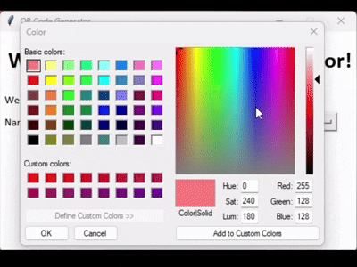

# QRcode Generator
A python program for creating QR codes for any website.

*Created with Python 3.14.5*

There are 3 different ways to run this program.

1. Navigate to `/dist` and launch `"gui.exe"`
2. Type: `"python gui.py"`
    - The gui program takes 4 inputs from the user:
        1. The URL of the website
        2. The name they want the QR code to be labeled
        3. The color of the QR code (via ColorSelector)
        4. The file type (`.png`, `.jpg`, or `.svg`)
3. Type `"python main.py"` to run via terminal
    - The terminal program takes 3 inputs from the user:
        1. The URL of the website
        2. The name they want the QR code to be labeled
        3. The color of the QR code

The program will output an image of the QR code in the `/generated_codes` folder. Currently, the executable saves the images inside the `dist` folder.
There are 3 example pictures in the `/generated_codes` folder, to demonstrate how the app can be used to save QR codes of different colors and types. 

<!-- 
<!-- 

 -->

    
    
    
    

*Built with Python, by Sam Lowry 2026*
